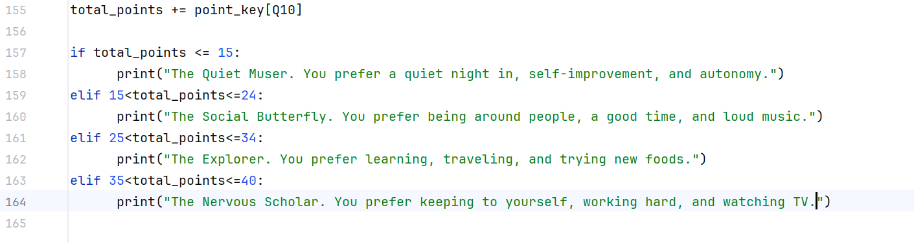

# CS105/6/7/8 Portfolio
# Olivia Michalik
## Portfolio
Contact Info: osmichalik@loyola.edu
### About Me 
Hi! My name is Olivia Michalik, and I am an aspiring Health Policy worker and Musician.
With skills in collaboration, time management, accessible communication, and critical thinking, I am able
to work smoothly with others, manage multiple tasks at once, and learn quickly. I can effectively work with Microsoft Office, Google Suite, MatLab, and PyCharm.
My ever-growing skill set, commitment to accessibility, and passion for justice establish me as a valuable and adaptable asset in many fields. 

### Education 
Biohealth & Music Major, Loyola University Maryland
***
### Projects

#### Personality Test
 - This is a 10 question personality test that assesses intrinsic thought, outward communication, and personal preferences.
I built it using GitHub and PyCharm under the guidance of my Computer Science professor in the Spring. 

[Link to Personality Test Code](https://github.com/LoyolaUnivMD/sp26-cs105-python-final-project-111olivia.git)
 - This project sought to discern different personality types and define each accordingly. My biggest challenge in creating it was assigning each multiple choice answer a number and summing them up to calculate a total score. 
I achieved this goal smoothly and would love to work on expanding it in the future. 
***
#### Faux Business Dashboard
 - Expanding on data aggregation and analysis of an imaginary business, this Excel sheet combines information about inventory, profit margins, business loans, and visual data. 

 - This interative sheet works to simplify business data and calculate monetary values. I used different formatting and calculation tools in Excel. The most difficult thing was building the Data Validation List. I worked through minimal issues quickly and would love to expand on this in an office/occupational setting.
***
#### PowerPoint Presentation
 - This was a self-designed, 10-minute video presenting a PowerPoint on the modules regarding 
the previous four modules on email, hardware and software, Outlook, and cloud storage. 
 - [insert project 3 screenshot here]
 - Project 3 Report
